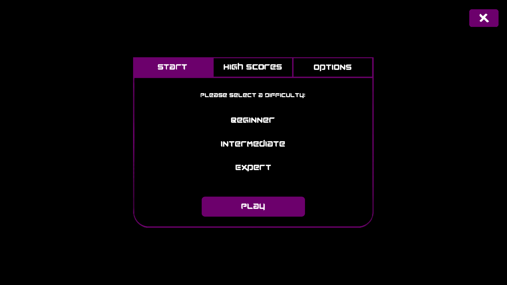

# Dwindling Galaxies

**It is a period of intergalactic war; a lone survivor must defend his home from invading alien forces; The Talz, Mondoshawans and Helghast**.

A 2D space shooter game inspired by classic arcade shooters, featuring local leaderboards, cut scenes, varying difficulty settings, and power-ups. 
This project was completed alongside three other team members using C++ and   SFML. The project included implementing local leaderboards to track 
high scores, creating engaging cut scenes for enhanced storytelling, introducing multiple difficulty levels for diverse player skill sets, and 
designing various power-ups for added excitement and strategic depth. The technical implementation utilised an object-oriented structure in C++ for  modularity and maintainability employed SFML for graphics rendering and user input handling, and incorporated collision detection and response systems 
to manage interactions between players and enemy objects, ensuring smooth gameplay.

.png)

---

## **Overview**

This project is a 2-D space shooter game inspired by classic arcade shooters. It features engaging gameplay mechanics, local leaderboards, cut scenes, varying difficulty levels, and an array of power-ups to enhance the    player experience. The game was developed using C++ and SFML. 

### **Features**

- **Engaging Gameplay:** The game offers fast-paced and exciting shooter action with responsive controls and challenging enemies.
- **Local Leaderboards:** Players can compete for the highest score on local leaderboards, adding a competitive element to the game.
- **Cut Scenes:** The game includes narrative cut scenes that provide context and enhance the overall experience.
- **Difficulty Settings:** Players can choose from multiple difficulty levels, catering to both casual and hardcore gamers.
- **Power-Ups:** Various power-ups are available throughout the game, offering temporary boosts and special abilities to the player.

### **Technical Implementation**

 - **Object-Oriented Design:** The game is structured using object-oriented programming principles, ensuring modularity and ease of maintenance.
 - **Graphics Rendering:** SFML (Simple and Fast Multimedia Library) is used for graphics rendering, providing smooth and visually appealing animations.
 - **User Input Handling:** SFML is also utilized for handling user inputs, ensuring responsive and accurate control over the game character.
 - **Collision Detection:** The game includes robust collision detection and response systems for gameplay interactions, making sure that all in-game collisions are accurately processed.
 - **Sound Effects and Music:** The game features sound effects and background music to enhance the immersive experience.
 - **Building Game Package:** Successfully packaged the final game into an application that can be installed on Windows Operating Systems.

### **Team**

- **Max Busato:** Lead Developer, responsible for core gameplay mechanics and overall project coordination.
- **Liam Hennig:** Assisted in implementing graphics and user input handling.
- **Oscar Popping:** Contributed to the design and development of the cut scenes and difficulty settings.

---

## **Installation and Setup**

1. **Download the latest release from the `Releases` page.**
2. **Extract the `.zip` file.**
3. **Navigate to the `dist/` folder.**
4. **Choose your platform:**
   - **Windows:** Open the `Windows-x64/` folder and run `Dwindling_Galaxies.exe`

> **That's it! No installation required.**

---

## **Future Enhancement**

- **Online Leaderboards:** Integrate online leaderboards to allow players to compete globally.
- **Additional Levels:** Develop more levels with unique themes and increasing difficulty.
- **Multiplayer Mode:** Implement a multiplayer mode for cooperative and competitive play.

---

## **License**

This project is licensed under a Proprietary License. See the [LICENSE](LICENSE.md) file for details. 

---
